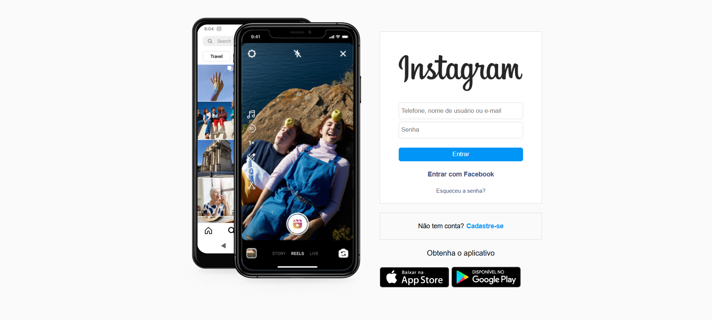
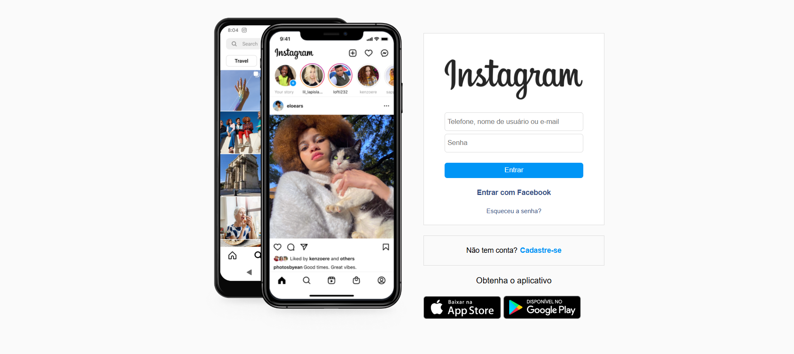

# Clone da Página de Login do Instagram

Este projeto é um clone da página de login do Instagram, desenvolvido utilizando HTML, CSS e JavaScript. O objetivo principal foi recriar a interface visual da página de login, incluindo a animação das imagens no celular.

## Funcionalidades

* **Interface de Login:**
    * Campos para inserir telefone, nome de usuário ou e-mail.
    * Campo para inserir senha.
    * Botão de "Entrar".
    * Links para "Entrar com Facebook" e "Esqueceu a senha?".
* **Cadastro:**
    * Link para cadastro de novas contas.
* **Download do Aplicativo:**
    * Links para download do aplicativo na App Store e Google Play.
* **Animação de Imagens:**
    * As imagens dentro do celular na página inicial alternam automaticamente a cada 3 segundos, simulando a troca de telas do aplicativo.

## Tecnologias Utilizadas

* **HTML:** Estrutura da página.
* **CSS:** Estilização da página.
* **JavaScript:** Animação das imagens.

## Visualização do Projeto



## Como Executar

1.  Clone o repositório para sua máquina local.
2.  Abra o arquivo `index.html` em seu navegador.

## Código JavaScript

O arquivo `scripts.js` contém o seguinte código para a animação das imagens:

```javascript
let imagem = document.querySelector(".troca-imagem")

function trocaImagem (){

    if(imagem.style.opacity == 0 ){
        imagem.style.opacity = 1
    } 

    else {
        imagem.style.opacity = 0
    }


}

setInterval(trocaImagem, 3000)